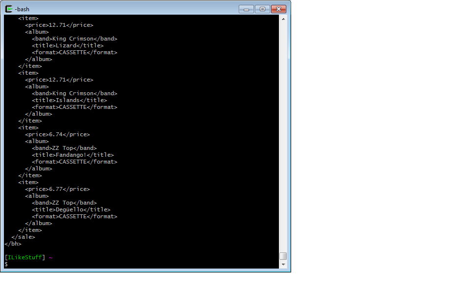
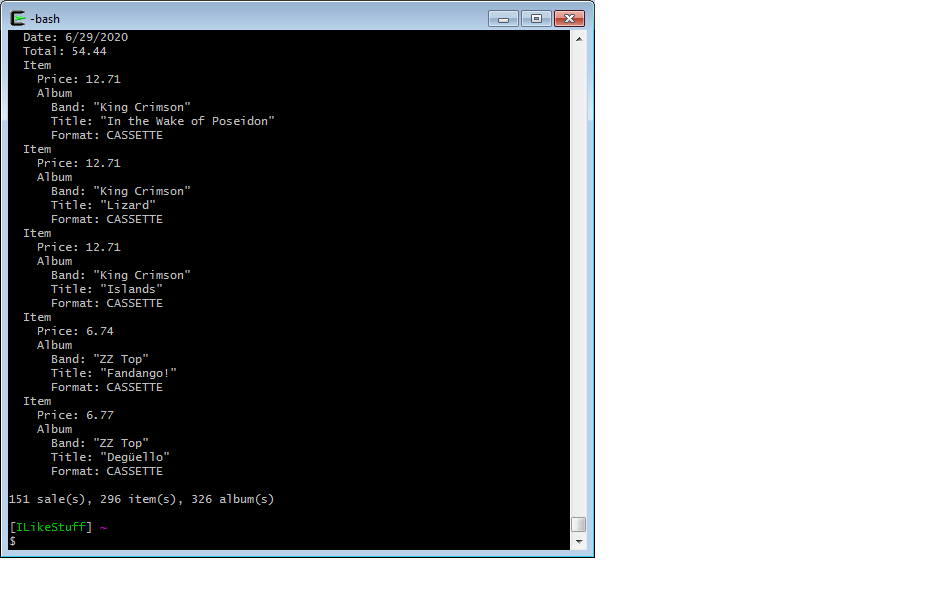

# buying-history  
As a teenager I had a small collection of Heavy Metal cassette tapes, but I sold them when I was 19; I guess I felt I had outgrown them. Then in 2006 when I discovered eBay and Amazon at 30, I started collecting tapes again. I guess I wanted to rekindle my youth. And because I'm fastidious, I kept track of my purchases in a text file with a format of my own devising.

## Phase 1
[Buyinghistory.txt](legacy_files/Buyinghistory.txt)

Not exactly reader-friendly. 

I knew I needed a standard file format, so in 2008 while I was going to PCC for Computer Science I wrote a one-off Java program to convert my precious gobbledygook into XML. I even wrote it in pseudocode first in proper academic fashion. Unfortunately I have neither the Java nor the pseudocode anymore, but my program worked beautifully. 

<dl>
  <dt>Problem</dt>
  <dd>I had to continue tracking my purchases.</dd>
  <dd>I wanted to avoid typing raw XML by hand.</dd>
  <dd>I discovered sed which I soon became enamored with.</dd>
  <dt>Solution</dt>
  <dd>I wrote a sed script to convert my original file to XML. </dd>
</dl>

I had a makefile to simplify the process. 

[Makefile](legacy_files/Makefile)

I wrote some scripts to make sure my conversion worked. 

[newbuyers.sed](legacy_files/newbuyers.sed)
[newbuyers.sed](legacy_files/oldbuyers.sed)
[newbuyers.sed](legacy_files/newtitles.sed)
[newbuyers.sed](legacy_files/oldtitles.sed)

And a few ancillary scripts like this one:

```
# albumsby
#
# Usage: albumsby band
#
# Displays all the albums by band specified on command line

if [ $# -eq 0 ]; then
	echo Usage: albumsby BAND
	echo 
	echo Searches bh.xml and displays all albums by BAND specified on command line.
	exit
fi	

if ! grep -qi "<band>$*<" bh.xml; then 
	echo $* not found
	exit 1
fi	

# Command line args are converted to lowercase as is the file data
# thus making the search case-insensitive
band=`echo $* | sed -e "/.*/y/ABCDEFGHIJKLMNOPQRSTUVWXYZ/abcdefghijklmnopqrstuvwxyz/"`

script="/.*/y/ABCDEFGHIJKLMNOPQRSTUVWXYZ/abcdefghijklmnopqrstuvwxyz/
/<band>$band/{"
script=$script'n
s!^ *<title>\([^<]*\).*!\t\1!
p
}'

echo $*:
sed -n "$script" bh.xml
```

Which produced such glorious output as this: 

```
$albumsby Black Sabbath
Black Sabbath:
	Black Sabbath
	Black Sabbath (Import)
	Paranoid
	Live At Last (Import)
	Sabbath, Bloody, Sabbath
	Sabotage
	We Sold Our Souls For Rock And Roll
	Technical Ecstasy
	Never Say Die
	Heaven And Hell
	Mob Rules
	Born Again
	Born Again
	Headless Cross

```

This was all done on the command line using Cygwin (a Linux emulator for Windows) and the vi text editor. And all these files can be found in the `legacy_files` directory.

In the back of my mind, though, I had a feeling that my XML schema may not be as robust as it could be, but I didn't give it much thought as I was too consumed with the vagaries and vicissitudes of everyday life. Then one day something unexpected happened and I was confronted with a stark new reality.

On January 9 2010, I broke my schema.

You see, some tapes are sold as a *lot* meaning multiple tapes sold as one item. To account for this, I used a `price` attribute on the `<album>` element for tapes sold individually and a `subtotal` attribute on the `<sale>` element for tapes sold as a lot. This had been adequate until one crisp January afternoon when I decided to buy a single tape ***and*** a lot from the same seller at the same time. And that was that.  
My Weltanschauung went kaput.

It was time to refactor my XML.

## Phase 2

It was really a simple solution, melodrama notwithstanding.   
- I wrapped each individual album and lot in an `<item>` tag. 
- I dispensed with using attributes altogether and moved everything into its own element to make it easier to process with XSLT.
- I moved `price` from an attribute of `<album>` to a child element of `<item>` thus ridding myself of the redundant subtotal attribute. 
- And finally, influenced by the terseness of Linux commands and willfully flaunting XML's inherent verbosity, I abbreviated the name of the root node. (Admittedly, a manifestation of my antinomian tendencies.)

And the all new bh.xml was born.

```xml
<bh>
  <sale>
    <store>eBay</store>
    <seller>_gnasher670</seller>
    <date>2007-01-03</date>
    <total>7.27</total>
    <item>
      <price>2.37</price>
      <album>
        <band>Testament</band>
        <title>Practice What You Preach</title>
        <format>CASSETTE</format>
      </album>
      <album>
        <band>Testament</band>
        <title>The New Order</title>
        <format>CASSETTE</format>
      </album>
    </item>
  </sale>
  ...
</bh>
```
With my Weltanschauung now restored, I moved on to my next goal which was to bring my fetish to the light of day. 

I had the good fortune of happening upon a [book][1] about XSLT at a second hand store which opened up a myriad of possiblities. I got a web hosting account, FileZilla FTP client

[Peter Grace's Tape Buying History](https://petergrace.site/buying-history/)

## Phase 3

In July of 2020 as a student at the Tech Academy, I had the opportunity to create a console application in C# using Entity Framework Code First. It should come as no surprise that I took the opportunity to bring my years-long goal closer to fruition.

Output of `$bh xml`, `$bh print`, and `$bh add`.






## Phase 4? 

I discovered/realized a few things while writing this README. I 
- I want to change the `<store>`, `<seller>`, `<total>`, `<date>`, and `<price>` elements back to being attributes. It looks more sleek, and it's also more colorful with syntax highlighting.
- The console app needs error checking to test for empty strings on input.

- Create a web application using MVC.

I realize that it's purely a vanity piece of software but it's a labor of love.

[1]: <https://www.amazon.com/XSLT-Working-Khun-Yee-Fung/dp/0201711036/> "XSLT: Working with XML and HTML by Khun Yee Fung" 
