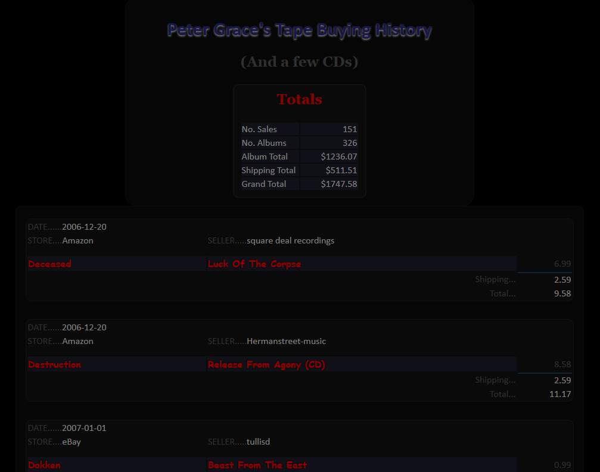
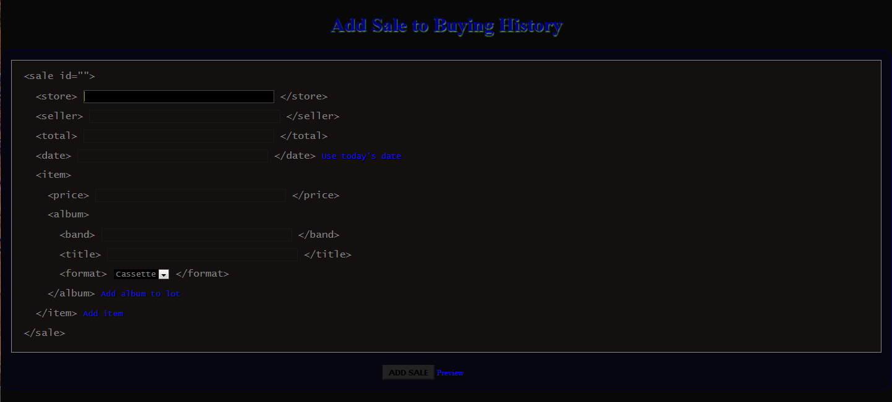

# buying-history  
As a teenager I had a meager collection of Heavy Metal cassette tapes, but I sold them when I was 19; I guess I felt I had outgrown them. Then in 2006 when I discovered eBay and Amazon at 30, I started collecting them again. I guess I wanted to rekindle my youth. And because I'm fastidious, I kept track of my purchases in a text file with a format of my own making.
## Stage One
```
#SELLER:BAND{"ALBUM"[:PRICE][,"ALBUM"[:PRICE]]}[,BAND{"ALBUM"[:PRICE][,"ALBUM"[:PRICE]]}]:[SUBTOTAL]:TOTAL:DATE
_gnasher670:Testament{"Practice What You Preach","The New Order"}:2.37:7.27:1/3/07
tragedian1:Slayer{"Reign In Blood":7.50},Trouble{"The Skull":2.99},Xentrix{"Shattered Existence":7.16}::21.65:1/19/07
thepollies:Exciter{"Heavy Metal Maniac","Long Live the Loud","Exciter"},Mercyful Fate{"In the Shadows":1.99}::9.73:1/9/07
roundflat:Entombed{"Clandestine"}:1.52:5.52:1/9/07
roger2095:Mercyless{"Abject Offering"}:4.99:6.74:1/11/07
bigmustafa:Helloween{"Judas":3.00},Pantera{"Vulgar Display Of Power":3.00},Testment{"The Legacy":3.00},King Diamond{"Fatal Portrait":3.00}::16.50:1/12/07
millimidian:King Diamond{"Them"}:3.50:6.45:1/16/07
mmusic:Oingo Boingo{"Best Of Boingo":4.99,"Boingo Alive":5.99},Sacrilege{"Within The Prophecy":5.99},Holy Moses{"Queen Of Siam":5.99},Nevermore{"Nevermore":4.99}::33.45:4/24/08
...
```
Not exactly reader-friendly.  
Then in 2008 while I was going to PCC for Computer Science I decided to convert my precious gobbledygook into XML. I did it in Java because I was taking a Java course at the time. I even wrote it out in pseudocode first in proper academic fashion. Unfortunately I have neither the Java nor the pseudo code anymore, but it worked beautifully. 
```xml
<buyinghistory>
  <sale seller="_gnasher670" subtotal="2.37" total="7.27" date="2007-01-03">
    <album>
      <band>Testament</band>
      <title>Practice What You Preach</title>
    </album>
    <album>
      <band>Testament</band>
      <title>The New Order</title>
    </album>
  </sale>
  <sale seller="tragedian1" subtotal="" total="21.65" date="2007-01-19">
    <album price="7.50">
      <band>Slayer</band>
      <title>Reign In Blood</title>
    </album>
    <album price="2.99">
      <band>Trouble</band>
      <title>The Skull</title>
    </album>
    <album price="7.16">
      <band>Xentrix</band>
      <title>Shattered Existence</title>
    </album>
  </sale>
  <sale seller="mmusic" subtotal="" total="33.45" date="2008-04-24">
    <album price="4.99">
      <band>Oingo Boingo</band>
      <title>Best Of Boingo</title>
    </album>
    <album price="5.99">
      <band>Oingo Boingo</band>
      <title>Boingo Alive</title>
     </album>
     <album price="5.99"
       <band>Sacrilege</band>
       <title>Within The Prophecy</title>
     </album>
     <album price="5.99">
       <band>Holy Moses</band>
       <title>Queen Of Siam</title>
     </album>
     <album price="4.99">
       <band>Nevermore</band>
       <title>Nevermore</title>
     </album>
  </sale>
  ...
</buyinghistory>
```

Because XML is so verbose I continued tracking my purchases in my own format and used a sed script to convert it to XML.

```sed
# convertbh.sed2
#
# Usage: sed -f convertbh.sed bh.old
#
# A sed script that converts Buyinghistory.txt into XML. 
# New in this version:
# seller, subtotal, total, and date information are stored as attributes of the
# sale element, and album price is stored as attribute of album element--the
# items element is removed.  An xml declaration is also inserted at beginning
# of file.

## BEGIN ##

# First line of file is comment, so have to insert before first line is deleted
1i\
<?xml version="1.0" encoding="US-ASCII" standalone="yes" ?>\
<!DOCTYPE buyinghistory [\
	<!ELEMENT buyinghistory (sale*)>\
	<!ELEMENT sale (album*)>\
	<!ELEMENT album (band, title)>\
	<!ELEMENT band (#PCDATA)>\
	<!ELEMENT title (#PCDATA)>\
	<!ATTLIST sale seller CDATA #REQUIRED\
				   subtotal CDATA #REQUIRED\
				   total CDATA #REQUIRED\
				   date CDATA #REQUIRED\
	>\
	<!ATTLIST album price CDATA #IMPLIED>\
]>\
<?xml-stylesheet type="text/xsl" href="bh.xsl" ?>\
<buyinghistory>

# delete comments
/^#/d

# Extract initial tags, and put all album info at beginning of line, so later
# when the pattern space is appended to the hold space the unprocessed text
# will be at start of line and can be easily erased.
s!\([^:]*\):\(.*\):\([^:]*\):\([^:]*\):\([^:]*\)$!\2<sale seller="\1" subtotal="\3" total="\4" date="\5">!

# convert date from M/D/YY to YYYY-MM-DD, save to hold space and isolate
# album info
s!\([0-9][0-9]\)/\([0-9][0-9]\)/\([0-9][0-9]\)!20\3-\1-\2!
s!\([0-9][0-9]\)/\([0-9]\)/\([0-9][0-9]\)!20\3-\1-0\2!
s!\([0-9]\)/\([0-9][0-9]\)/\([0-9][0-9]\)!20\3-0\1-\2!
s!\([0-9]\)/\([0-9]\)/\([0-9][0-9]\)!20\3-0\1-0\2!
h 
s!<.*>$!!

# xml-ize album price. # is added as a place holder to facilitate converting
# the price element into an album attribute later.
s!":\([^,}]*\)\([,}]\)!"#<price>\1</price>\2!g

# if no price, add empty price tag
s!"\([,}]\)!"#<price></price>\1!g

# xml-ize album title
s!"\([^"]*\)"!<title>\1</title>!g

# put all albums by same band on separate line
s!},!\n!g

# insert newline at beginning of line to facilitate processing album info
s!^!\n!

# xml-ize band name. @ added as place holder to facilitate next step. Necessary
# when there are multiple albums in a sale AND multiple albums by same bands.
s!\n\([^{]*\){!\n@<band>\1</band>!g

# insert band tag for multiple albums by same band, and delete @ place holder
:loop
s!\(<band>[^>]*>\)\([^@]*\),<ti!\1\2,\1<ti!
t loop
s!@!!g

# put each album on separate line and get rid of closing brace
s!>,!>\n!g
s!}$!!

# add album tag
s!\n<ba!\n<album><ba!g
s!ce>\n!ce></album>\n!g
s!ce>$!ce></album>!

# move price from being its own element to being attribute of album element,
# and delete empty price attributes
s!<album>\([^#]*\)#<price>\([^<]*\)</price>!<album price="\2">\1!g
s! price=""!!g

# get rid of extraneous newline, and put all tags on separate line
s!^\n!!
s!><!>\n<!g

# append to hold space, retrieve new hold space, and delete unprocessed text
H
g
s!^[^<]*\(<.*\)!\1!

# Insert ending tags (each line in old file represents one sale). Indenting must
# be added here because the inserted/appended text does not become part of the
# pattern space.
a\
  </sale>
$a\
</buyinghistory>

# add indenting
s!<sal!  &!g
s!<alb!    &!g
s!</al!    &!g
s!<ban!      &!g
s!<tit!      &!g

## END ##
```

I even had a makefile to simplify the process. 

```make
bh.xml : bh.old convertbh.sed
	sed -f convertbh.sed bh.old > bh.xml

bh.old : Buyinghistory.txt
	cp Buyinghistory.txt bh.old
```

This was all done in Cygwin using the command line and vi text editor, by the way.
At a certain point though I realized a couple things: 
- I wasn't keeping track of the "store" (eBay or Aamazon, etc.)
- Some tapes were sold as a "lot" meaning multiple tapes sold as one item 
- The subtotal attribute was redundant 
- And once in a while I bought a CD

In other words, my schema was inadequate.

## Stage Two

Around the time of the Mayan apocalypse, I picked up a book about XSLT at Goodwill and with a little research into PHP I was able to convert my XML into HTML. And my fetish came alive for the whole world to see.  

  

I still had to update my XML file manually. The upkeep of entering new sales became tiresome, so I wrote a bash script to update my XML file, or bh.xml as I called it. My pride and joy. Unfortunately, I don't have the script anymore. My ultimate goal however was to store it in a database and create a web form to update it.  

  

I tried to use Javascript, but my knowledge of Javascript was limited to an Introduction to Computer Science class I took in 2005. I wasn't even aware of jQuery at the time. This was 2013. For years I kept buying tapes and updating bh.xml manually (utilizing my bash script, of course), until July of 2020 when I was given the opportunity to create a console application in C# using Entity Framework Code First. It should come as no surprise that my first thought was to bring my years-long goal to fruition. And so I did.  

## Stage Three

I realize that it's purely a vanity piece of software but it means a lot to me.


